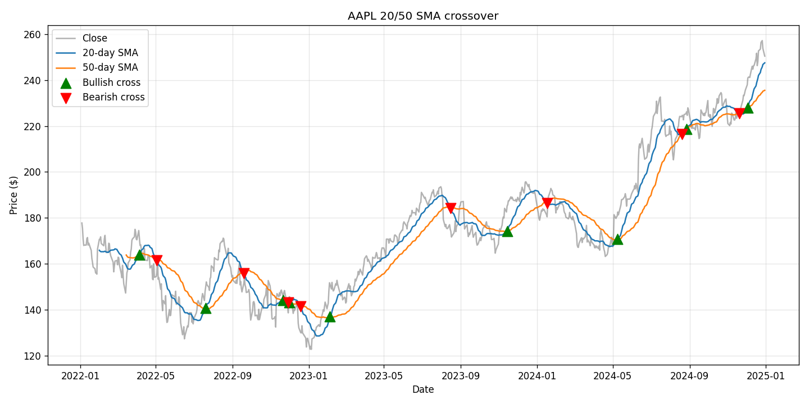

# Moving Average Crossover Analyzer

A small Python tool that downloads daily stock prices for whatever ticker and
date range you give it, calculates a short and a long simple moving average,
and marks the days where they cross.

The idea is a pretty common trading rule:
- short average crosses **above** the long one = bullish ("golden cross")
- short average crosses **below** the long one = bearish ("death cross")

Here's AAPL from 2022 to 2024 with 20 and 50 day averages:



## Running it

```
pip install -r requirements.txt
python main.py AAPL 2022-01-01 2024-12-31
```

You can change the windows and save the chart instead of opening it:

```
python main.py TSLA 2023-01-01 2024-06-30 --short 10 --long 30 --save tsla.png
```

If you just run `python main.py` it'll ask you for the ticker and dates.

Output looks like this:

```
AAPL: 17 crossovers

  2022-04-05  BULLISH   close = $171.22
  2022-05-03  BEARISH   close = $155.98
  ...
```

## How it works

Everything is in the `CrossoverAnalyzer` class in `analyzer.py`.

- Prices come from Yahoo Finance using `yfinance`
- The moving averages are just `rolling(n).mean()` in pandas
- For the crossovers I make a column that's 1 when the short average is above
  the long one and 0 when it isn't. Taking `diff()` of that gives +1 on the
  day it crosses up and -1 on the day it crosses down.
- The chart is matplotlib, with green/red triangles on the crossover days

## Tests

The tests use made-up price lists so they don't need internet:

```
pytest
```

## Things I noticed / might add

- Shorter windows give way more signals but a lot of them are fake. When the
  price is going sideways the averages keep crossing back and forth (TSLA in
  Oct 2023 flipped three times in about two weeks).
- Would be cool to backtest it and see if following the signals actually
  beats just buying and holding.

Not financial advice, this was just for learning.
